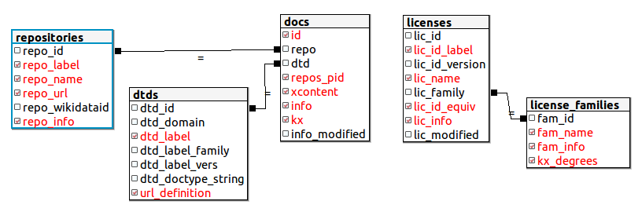

# Open Coherence
This project, a mini-framework for check openness-coherence of legal and scientific contents, offers tools and datasets for describe open contents with certainty of openness and tools for measure the degreee of openess.

## Introduction
Legal and scientific documents are typical [free contents](https://en.wikipedia.org/wiki/Free_content#Legislation), and in recent years they are stored in big digital repositories that archives publicly accessible full-text documents in standard formats, as a form of *digital [legal deposit](https://en.wikipedia.org/wiki/Legal_deposit)*.

* Typical repositories of scientific literature (''sci-docs''): [SciELO](https://en.wikipedia.org/wiki/SciELO) and [PubMed Central](https://en.wikipedia.org/wiki/PubMed_Central). Access to contents in [XML JATS format](https://en.wikipedia.org/wiki/Journal_Article_Tag_Suite) and PDF.

* Typical repositories of legislation (''law-docs''): [BR (LexML)](http://www.lexml.gov.br/),  [EU countries (N-Lex)](http://eur-lex.europa.eu/n-lex/), [UK (legislation)](http://www.legislation.gov.uk/browse). Access to contents in HTML, PDF and other formats.

In both (sci-docs and law-docs) the content is published by an authority, like a [scientific journal](https://en.wikipedia.org/wiki/Scientific_journal) or a [government gazette](https://en.wikipedia.org/wiki/Government_gazette). Only official versions of the documents possess legal probative value. The *official repositories* preserves the documents and its  probative value.

## UNDER CONSTRUCTION

For draft presentation, see [README.old.md](_olds/README.old.md).

Shared datasheet with friendly interface to edit CSV sources:

 * [openCoherenceDataset-licenses](https://docs.google.com/spreadsheets/d/17RwlPayXj2IBIBszp4wKMdK7OwwPqX125WmF3XFzM0A/edit?usp=sharing)

 * [openCoherenceDataset-repos](https://docs.google.com/spreadsheets/d/1HrMi0qWjvnEjX3kRD_1o4DJ8U4P7EBv1tx8Euw09K80/edit?usp=sharing)

These curated data are transferred to here as [CSV+JSON](http://data.okfn.org/doc/tabular-data-package) files, and handled as SQL (and SQL+JSON) related tables, as implmented by [`ini.sql`](src/ini.sql) and illustrated below.  



## Install

Use PostgreSQL 9.3+.

 1. get all from github
 2. configure database, configure parameters at [ini.php](src/ini.sql).
 3. run [`ini.sql`](src/ini.sql).
 4. run [`ini.php`](src/php/ini.php).

Summarizing:
```bash
git clone https://github.com/ppKrauss/dataset_licenses.git
git clone https://github.com/ppKrauss/openCoherence.git
psql -h localhost -U postgres postgres < openCoherence/src/ini.sql
php openCoherence/src/php/ini.php
```

Check by SQL query... Examples:

```sql
 SELECT * FROM oc.licenses; -- as https://github.com/ppKrauss/dataset_licenses/blob/master/data/licenses.csv

 SELECT id,repos_pid, 
	kx->>'article_type' as type, 
	kx->>'article_title' as title
 FROM oc.docs
 WHERE xcontent IS NOT NULL;

 SELECT * FROM oc.repositories;

 SELECT * FROM oc.dtds;

 SELECT id,repo,repos_pid, (xpath('//front//abstract[1]',xcontent))[1] as abstract
 FROM oc.docs WHERE kx->>'article_type'='research-article';
         
 SELECT id,xcontent,repos_pid, 
   (xpath('//front//permissions[1]/license[1]',xcontent))[1]::text as license_for_human
 FROM oc.docs WHERE kx->>'license_url'='';
```


